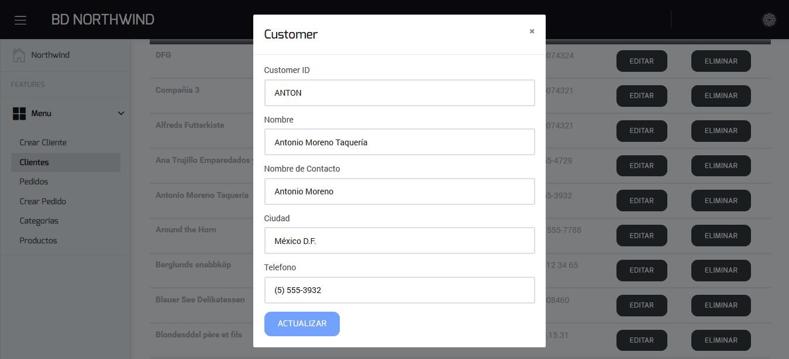

# Northwind CRUD
CRUD for Northwind DB, Web API (ASP.NET) made on C# and Front End on Angular.  
This project is a demonstration of several technologies

* [Entity Framework database-firts](#entity-framework)
* [ASP.NET Web API](#asp.net-web-api)
* [Angular](#angular)
  * [Web Interface](#web-interface)
    * [ScreenShots](#screenshots)

## Entity Framework

Entity Framework is an Object Relational Mapper (ORM) which is a type of tool that simplifies mapping between objects in your software to the tables and columns of a relational database. Entity Framework (EF) is an open source ORM framework for ADO.NET which is a part of .NET Framework.

## ASP.NET Web API

ASP.NET makes it easy to build services that reach a broad range of clients, including browsers and mobile devices. With ASP.NET you use the same framework and patterns to build both web pages and services, side-by-side in the same project.

## Angular

Angular is a platform that makes it easy to build applications with the web. Angular combines declarative templates, dependency injection, end to end tooling, and integrated best practices to solve development challenges. Angular empowers developers to build applications that live on the web, mobile, or the desktop.

### Web Interface

The web interface was made on the open source project [ngx-admin](https://akveo.github.io/ngx-admin/).

#### ScreenShots

